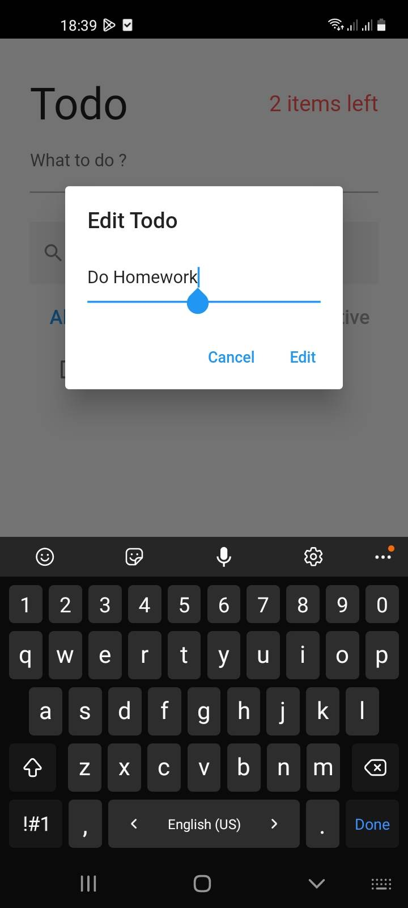
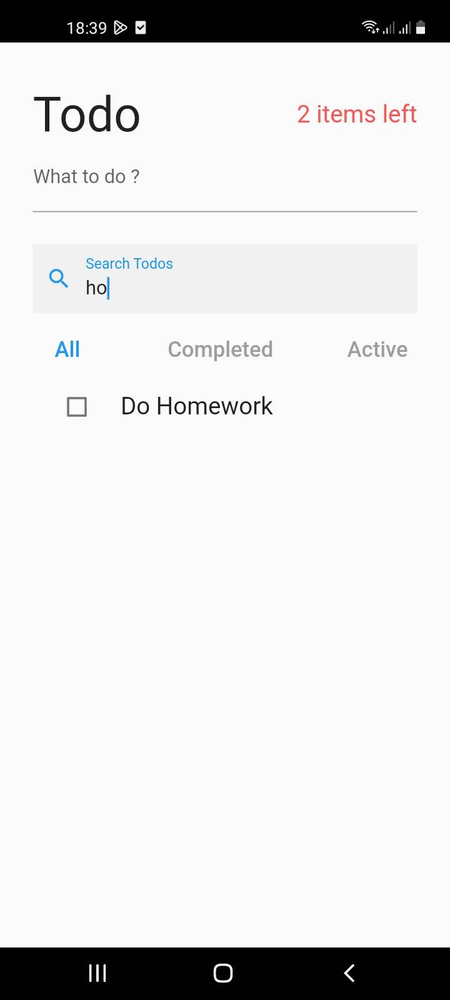
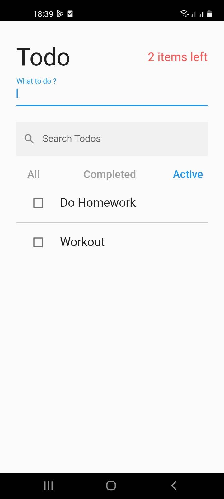
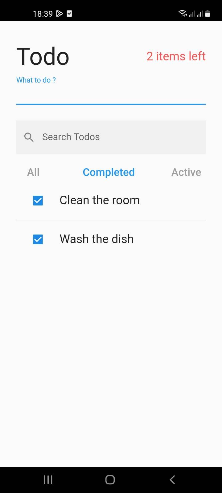
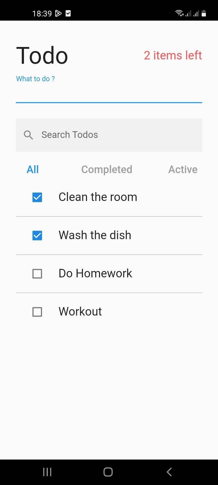

# Todo App

Simple Todo flutter application which uses **Provider** State Management Solution 

## App Functionalities

##### Add new task
##### Edit existing task
##### Search for a task
##### Mark a task as completed
##### Tasks Filtering
##### Delete tasks

     